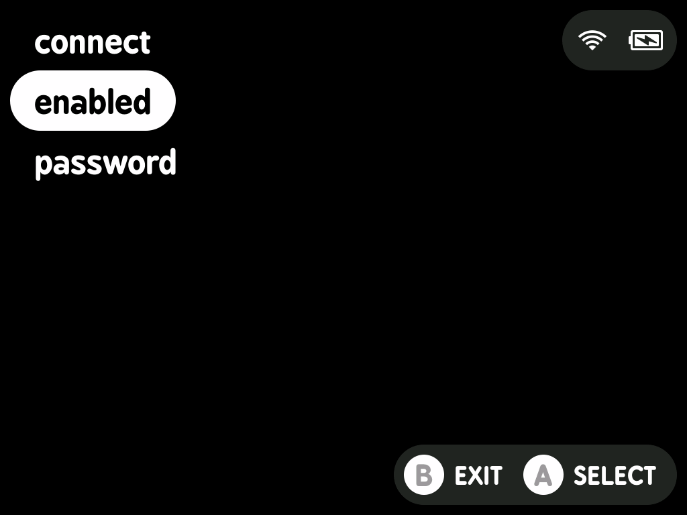

# minui list

This is a minui list app. It allows people to show a list of items or settings and then writes the selected item or state to stdout.

## Requirements

- A minui union toolchain
- Docker (this folder is assumed to be the contents of the toolchain workspace directory)
- `make`

## Building

- todo: this is built inside-out. Ideally you can clone this into the MinUI workspace directory and build from there under each toolchain, but instead it gets cloned _into_ a toolchain workspace directory and built from there.

## Usage

This tool is designed to be used as part of a larger minui app. It only supports an english keyboard layout, and has support for capitalized keys as well as many common special characters.

```shell
# default behavior is to read from a JSON file that contains a list of items at the root
# ["item-1", "item-2", "item-3"]
minui-list --file list.json

# you can also read from a JSON file that containing an object with an array of objects at a specific key
# note that the objects must have a "name" key, which will be used as the item name
# {"items": [{"name": "item-1"}, {"name": "item-2"}, {"name": "item-3"}]}
minui-list --file list.json --item-key "items"

# you can also read from newline-delimited strings by specifying the --format flag
# the default format is "json", but you can also specify "text"
minui-list --format text --file list.txt

# finally, you can read the input from stdin
# this is useful for reading from a pipe or a variable
# it is compatible with both json and text formats
echo -e "item1\nitem2\nitem3" | minui-list --format text --file -

# write the selected item to a file
minui-list --file list.json > output.txt

# or capture output to a variable for use in a shell script
output=$(minui-list --file list.json)

# specify a header for the keyboard page
# by default, the header is empty
minui-list --file list.json --header "Some Header"

# specify alternative text for the Confirm button
# by default, the Confirm button text is "SELECT"
minui-list --file list.json --confirm-text "CHOOSE"

# specify an alternative button for the Confirm button
# by default, the Confirm button is "A"
# the only buttons supported are "A", "B", "X", and "Y"
minui-list --file list.json --confirm-button "X"

# specify alternative text for the Cancel button
# by default, the Cancel button text is "BACK"
minui-list --file list.json --cancel-text "CANCEL"

# specify an alternative button for the Cancel button
# by default, the Cancel button is "B"
# the only buttons supported are "A", "B", "X", and "Y"
minui-list --file list.json --cancel-button "Y"

# specify a button for the Action Button
# by default, there is no action button
# when set, the default Action button text is "ACTION"
# the only buttons supported are "A", "B", "X", and "Y"
minui-list --file list.json --action-button "X" --action-text "RESUME"

# specify an alternative button for the Enable Button
# by default, the Cancel button is "Y"
# the button text is either "Enable" or "Disable"
# the only buttons supported are "A", "B", "X", and "Y"
minui-list --file list.json --enable-button "Y"

# write the current json state to stdout
# this will _always_ write the current state to stdout
# regardless of exit code
# the index of the selected item will be written
# to the top-level `selected` property
minui-list --file list.json --stdout-value state
```

To create a list of items from newline-delimited strings, you can use jq:

```shell
# create a JSON array from newline-delimited input
echo -e "item1\nitem2\nitem3" | jq -R -s 'split("\n")[:-1]'

# or read from a file containing newline-delimited items
jq -R -s 'split("\n")[:-1]' < items.txt

# or create a JSON array using pure bash
printf '[\n' > list.json
while IFS= read -r line; do
  printf '  "%s",\n' "$line"
done < items.txt | sed '$ s/,$//' >> list.json
printf ']\n' >> list.json
```

### File Formats

#### Text

A newline-delimited file.

```text
item 1
item 2
item 3
```

#### JSON

> [!NOTE]
> If an item is detected as a hex color, a small box showing that color will be shown to the right of the item entry in the list.

##### Array

A json array. May or may not be formatted.

```json
[
  "item 1",
  "item 2",
  "item 3"
]
```

##### Object

A list of objects set at a particular key. May or may not be formatted.

```json
{
  "items": [
    {
      "name": "item 1"
    },
    {
      "name": "item 2"
    },
    {
      "name": "item 3"
    }
  ]
}
```

Properties:

- name: (required, type: `string`) the option name
- enabled: (optional, type: `boolean`, default: `true`) whether the field shows up as enabled or disabled
- is_header: (optional, type: `boolean`, default: `false`) allows specifying that an item is a header
- options: (optional, type: `[]string`, default: `[]`) a list of strings to display as options
- selected_option: (optional, type: `integer`, default: `0`) the default selected option
- supports_enabling: (optional, type: `boolean`, default: `false`) whether or not an option can be enabled or disabled

### Exit Codes

- 0: Success (the user selected an item)
- 1: Error
- 2: User cancelled with B button
- 3: User cancelled with Menu button
- 4: User pressed Action button
- 10: Error parsing input
- 11: Error serializing output
- 130: Ctrl+C

## Screenshots

### Header


### No Header


