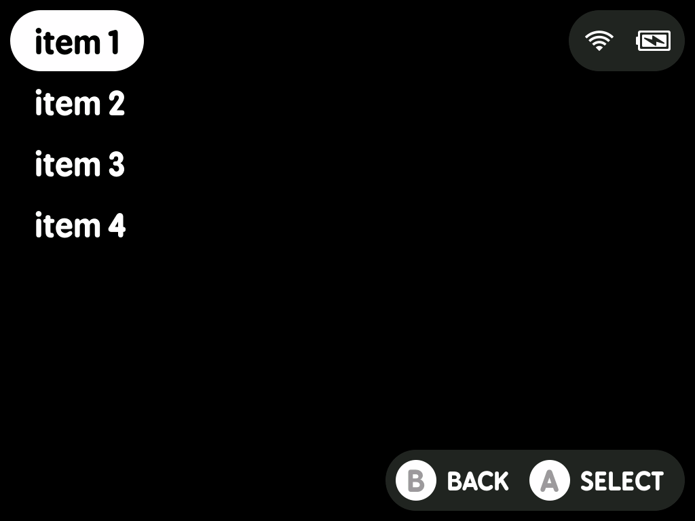
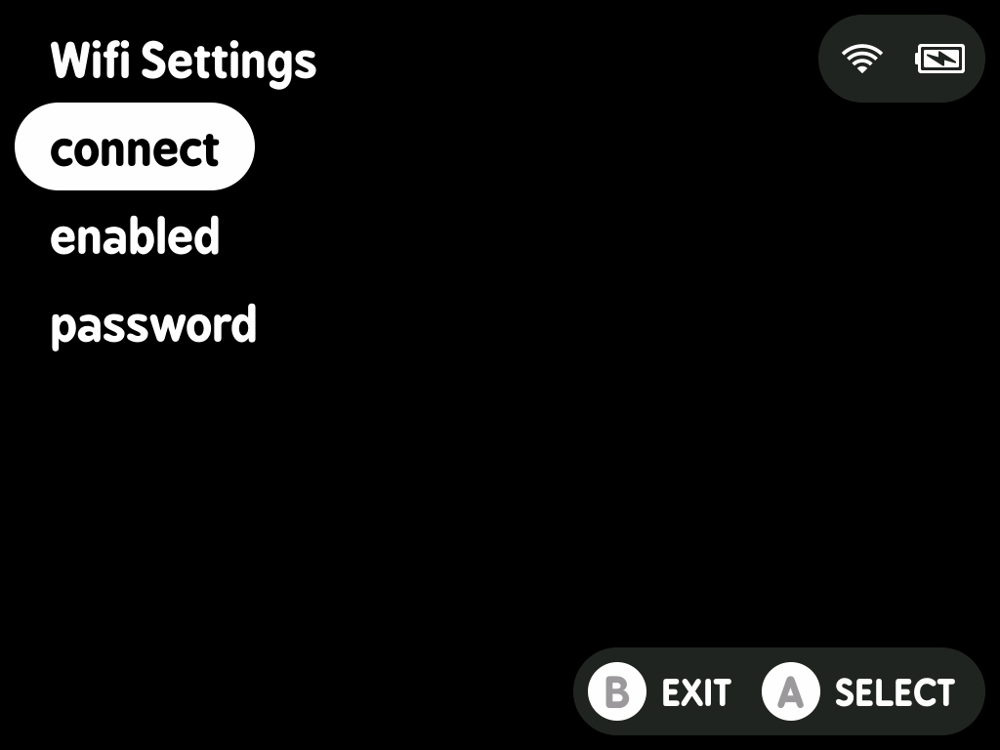
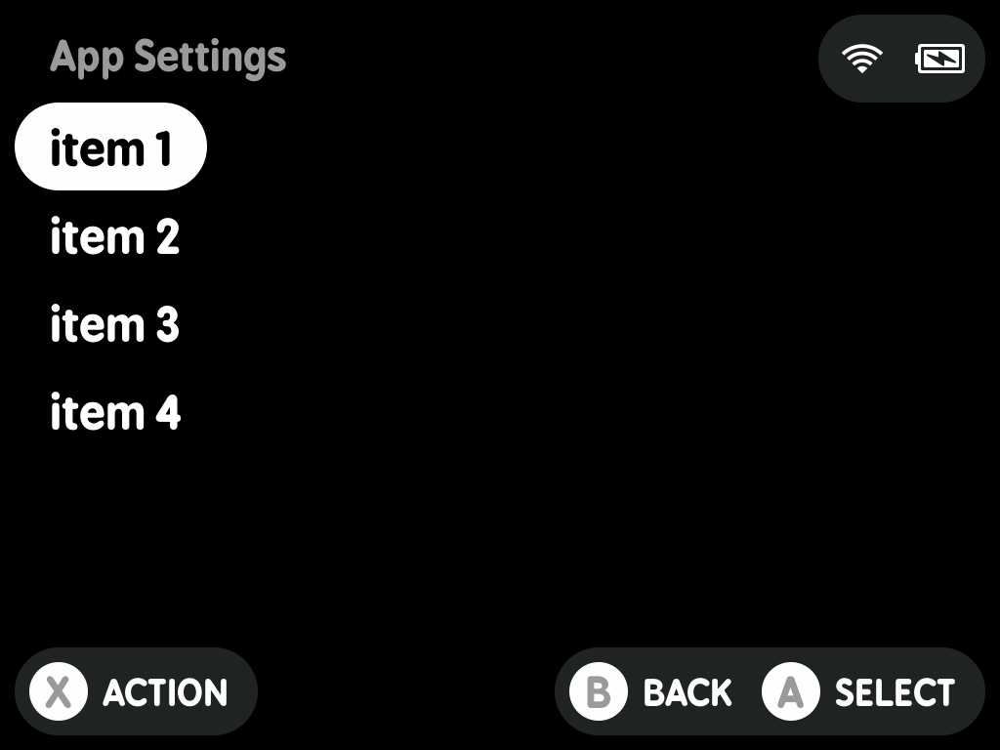
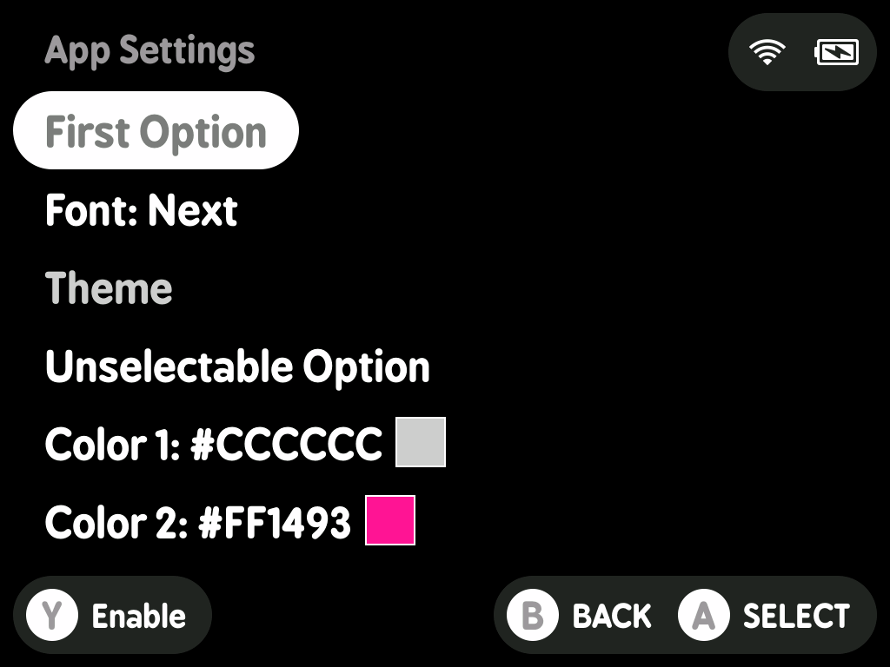
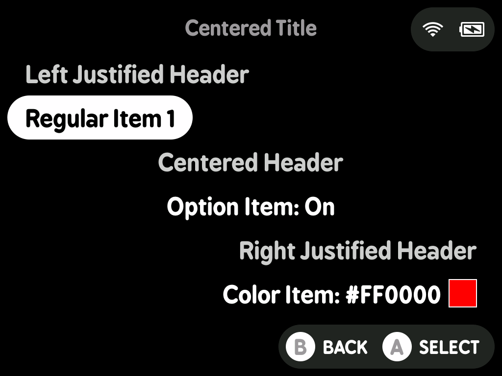

# minui list

This is a minui list app. It allows people to show a list of items or settings and then writes the selected item or state to stdout.

## Requirements

- A minui union toolchain
- Docker (this folder is assumed to be the contents of the toolchain workspace directory)
- `make`

## Building

- todo: this is built inside-out. Ideally you can clone this into the MinUI workspace directory and build from there under each toolchain, but instead it gets cloned _into_ a toolchain workspace directory and built from there.

The build platform is selected with `PLATFORM`, and the binary is named `minui-list-$(PLATFORM)`. For example, `PLATFORM=tg5040 make` produces `minui-list-tg5040`.

## Supported platforms

Binaries are built against one of two firmwares. Most devices build against MinUI (`shauninman/MinUI`). NextUI-specific binaries build against a NextUI toolchain and are suffixed with `-nextui`.

- `tg5040` and `my355` run both firmwares, so they have a MinUI build (`minui-list-tg5040`, `minui-list-my355`) and a NextUI build (`minui-list-tg5040-nextui`, `minui-list-my355-nextui`).
- `tg5050` and `h700` are NextUI-only and build as `minui-list-tg5050-nextui` and `minui-list-h700-nextui`.

To build a NextUI variant, use its platform id inside the matching toolchain, for example `PLATFORM=tg5040-nextui make`. See [docs/nextui.md](docs/nextui.md) for the platform/toolchain matrix and how the NextUI builds are wired. For the native macOS build used by the test suite, see [docs/macos.md](docs/macos.md).

## Usage

This tool is designed to be used as part of a larger minui app.

```shell
# default behavior is to read from a JSON file that contains a list of items at the root
# ["item-1", "item-2", "item-3"]
minui-list --file list.json

# you can also read from a JSON file that contains an object with an array of objects
# note that the objects must have a "name" key, which will be used as the item name
# {"items": [{"name": "item-1"}, {"name": "item-2"}, {"name": "item-3"}]}
minui-list --file list.json

# --item-key defaults to "items", so it only needs to be passed when the array
# lives under a differently-named key
# {"choices": [{"name": "item-1"}, {"name": "item-2"}, {"name": "item-3"}]}
minui-list --file list.json --item-key "choices"

# you can also read from newline-delimited strings by specifying the --format flag
# the default format is "json", but you can also specify "text"
minui-list --format text --file list.txt

# finally, you can read the input from stdin
# this is useful for reading from a pipe or a variable
# it is compatible with both json and text formats
echo -e "item1\nitem2\nitem3" | minui-list --format text --file -

# write the selected item to a file
minui-list --file list.json > output.txt

# or capture output to a variable for use in a shell script
output=$(minui-list --file list.json)

# you can also specify a location to write to
# the internal minui sdk sometimes writes to stdout
# depending on platform, so this may be useful
minui-list --file list.json --write-location file.txt

# background colors and images can be set
# the flags provide defaults, but they can be overriden
# for specific entries via json
minui-list --file list.json --background-color "#ababab"
minui-list --file list.json --background-image "full/path/to/image.png"

# a per-item image can be shown on the right-hand side of each row (json only)
# it is scaled to fit within a third of the screen width and the row height,
# and the item text is truncated to the remaining space
# images are set per item via the "features.images" property below

# an item can supply resolution-specific images via its "features.images" map
# --screen-resolution selects which entry to use (a "WIDTHxHEIGHT" string)
# by default the device resolution is auto-detected, so this only needs to be
# set to override the detected value
minui-list --file list.json --screen-resolution 1280x720

# show a fallback image when an item that specifies an image has no
# currently-existing file at its resolved path
minui-list --file list.json --fallback-image "full/path/to/fallback.png"

# specify a title for the list page
# by default, the title is empty
minui-list --file list.json --title "Some Title"

# specify alignment for the title
# left aligned by default, options are "left", "center", "right"
minui-list --file list.json --title "Centered Title" --title-alignment center

# specify alternative text for the Confirm button
# by default, the Confirm button text is "SELECT"
minui-list --file list.json --confirm-text "CHOOSE"

# specify an alternative button for the Confirm button
# by default, the Confirm button is "A"
# the only buttons supported are "A", "B", "X", and "Y"
minui-list --file list.json --confirm-button "X"

# specify alternative text for the Cancel button
# by default, the Cancel button text is "BACK"
minui-list --file list.json --cancel-text "CANCEL"

# specify an alternative button for the Cancel button
# by default, the Cancel button is "B"
# the only buttons supported are "A", "B", "X", and "Y"
minui-list --file list.json --cancel-button "Y"

# specify a button for the Action Button
# by default, there is no action button
# when set, the default Action button text is "ACTION"
# the only buttons supported are "A", "B", "X", and "Y"
minui-list --file list.json --action-button "X" --action-text "RESUME"

# specify an alternative button for the Enable Button
# by default, the Enable button is "Y"
# the button text is either "Enable" or "Disable"
# the only buttons supported are "A", "B", "X", and "Y"
minui-list --file list.json --enable-button "Y"

# a button may be assigned to more than one role
# when the same button is assigned to multiple roles, presses are
# resolved by precedence: action > cancel/confirm > enable
# for example, "Y" can be used as the action button even though it is
# also the default enable button
minui-list --file list.json --action-button "Y" --action-text "EXIT"

# write the current json state to stdout (or to the file)
# this will _always_ write the current state regardless of exit code
# the index of the selected item will be written
# to the top-level `selected` property
#
# the array of the items will be written to the top-level `items`
# property, containing the items used for list presentation - either
# the original items or sorted if alphabetic_scroll is used.
#
# Note that when alphabetic_scroll is used, selected item index
# is relative to the sorted list.
minui-list --file list.json --write-value state

# paths to a custom font (.otf or .ttf) can be specified
# the order of usage is:
#  --font-SIZE > --font-default > built-in minui font
# if the font is missing and is loaded, this will result in an error

# will use the specified font for all text sizes
minui-list --file list.json --font-default full/path/to/font.otf

# will use font-large.ttf for large text
# and the default minui font (BPreplayBold-unhinted.otf) for small text
minui-list --file list.json --font-large path/to/font-large.otf

# will use font.ttf for small text
# and font-large.ttf for large text
minui-list --file list.json --font-default full/path/to/font.otf --font-large path/to/font-large.otf

# will use font.ttf for large text
# and font-small.ttf for small text
minui-list --file list.json --font-default full/path/to/font.otf --font-small path/to/font-small.otf

# hardware hints (power/wifi) are shown by default
# but can be hidden by a flag
# note that the hardware hints are hidden if x/y buttons are displayed
minui-list --file list.json --hide-hardware-group

# minui-list will auto-sleep like the normal minui menu by default
# this can be disabled by setting the --disable-auto-sleep flag
minui-list --file list.json --disable-auto-sleep

# minui-list will hide the confirm button if the currently selected
# option is the same as the default selected option.
# the confirm button can be forced to always
# show by setting the --always-show-confirm flag
#
# this overrides the "hide_confirm" property in JSON input
minui-list --file list.json --always-show-confirm

# pre-select a specific item by index (0-indexed)
# this overrides the "selected" property in JSON input
minui-list --file list.json --selected 2

# enable alphabetical scrolling with L1/R1 buttons
# items will be sorted alphabetically automatically
# L1 jumps to the previous letter group, R1 jumps to the next
# both wrap around at the ends of the list
minui-list --file list.json --alphabetic-scroll

# autoscroll the selected item's name when it is too long to fit
# by default the name is truncated with an ellipsis ("...")
# the supported values are "false" (default), "wrap", and "pong"
# "wrap" is a continuous looping marquee; "pong" scrolls to the end,
# pauses, then scrolls back to the start
# only the currently selected item scrolls; other long items keep the ellipsis
minui-list --file list.json --scroll-method wrap

# the scroll method can also be set via the top-level "scroll_method" JSON
# property; when present in the JSON it takes precedence over the flag
minui-list --file list.json --scroll-method pong

# enable the inline filter keyboard
# filtering is off by default; --allow-filter must be set to "true"
# to allow it. an on-screen keyboard can then be toggled with a button
# and the list is filtered on-the-fly, with the matched text highlighted
minui-list --file list.json --allow-filter true

# choose the button that toggles the keyboard
# the default is "SELECT"; the supported values are "SELECT", "START",
# "L1", "R1", "L2", and "R2" (face buttons are reserved for the keyboard)
minui-list --file list.json --allow-filter true --filter-button L1

# show the keyboard as soon as the list opens
# false by default
minui-list --file list.json --allow-filter true --display-filter-keyboard true

# seed the initial filter text
minui-list --file list.json --allow-filter true --filter-input "hack"

# on exit, the final filter value is written as the last line of stderr;
# it can also be written to a file with --filter-text-file
minui-list --file list.json --allow-filter true --filter-text-file filter.txt
```

### Filtering

When `--allow-filter true` is set, pressing the filter button (`SELECT` by
default, configurable with `--filter-button`) opens an on-screen keyboard at the
bottom of the screen. The list filters as you type, and the matched portion of
each item's name is highlighted. Matching is case-insensitive.

While the keyboard is open:

- the **D-pad** moves the key cursor
- **A** activates the focused key (`shift` cycles the lowercase/uppercase/special
  layouts, `space` types a space, `enter` closes the keyboard)
- **B** deletes the last character
- **X** clears the whole filter
- the filter button (e.g. `SELECT`) closes the keyboard

With the keyboard closed, the list shows only the matching items and the normal
list controls apply, so you can navigate and select from the filtered results.

Headers are excluded from matching and are hidden while a filter is active. An
item with `features.display_on_filter` set to `true` stays visible even when it
does not match, which is useful for pinning an entry such as an "Add All" row to
the top of the list.

The keyboard matches the layout and behavior of the sibling `minui-keyboard`
tool, so it supports letters, numbers, symbols, and spaces.

To create a list of items from newline-delimited strings, you can use jq:

```shell
# create a JSON array from newline-delimited input
echo -e "item1\nitem2\nitem3" | jq -R -s 'split("\n")[:-1]'

# or read from a file containing newline-delimited items
jq -R -s 'split("\n")[:-1]' < items.txt

# or create a JSON array using pure bash
printf '[\n' > list.json
while IFS= read -r line; do
  printf '  "%s",\n' "$line"
done < items.txt | sed '$ s/,$//' >> list.json
printf ']\n' >> list.json
```

### File Formats

#### Text

A newline-delimited file.

```text
item 1
item 2
item 3
```

#### JSON

> [!NOTE]
> If an item is detected as a hex color, a small box showing that color will be shown to the right of the item entry in the list.

##### Array

A json array of strings. May or may not be formatted.

```json
[
  "item 1",
  "item 2",
  "item 3"
]
```

Every element must be a non-empty string. To supply object items (with names,
options, or features), use the object form below with `--item-key`. Passing an
array of objects, an empty string, or any non-string element fails with a
validation error rather than rendering.

##### Object

A list of objects set at a particular key. May or may not be formatted. Comments are allowed.

The key defaults to `items`, so the object form below works without any extra flags.
Pass `--item-key <key>` only when the array lives under a differently-named key.

```json
{
  "alphabetic_scroll": true,
  "items": [
    {
      "name": "Apple"
    },
    {
      "name": "Banana"
    },
    {
      "name": "Cherry"
    }
  ]
}
```

Top-level properties (on the root object, not on individual items):

- selected: (optional, type: `integer`, default: `0`) the index of the initially selected item. Can be overridden by the `--selected` CLI flag.
- alphabetic_scroll: (optional, type: `boolean`, default: `false`) enables L1/R1 alphabetical scrolling. When enabled, items are automatically sorted alphabetically and L1/R1 buttons jump between letter groups, wrapping around at the ends of the list. Headers and unselectable items are skipped.
- scroll_method: (optional, type: `string`, default: `false`) how to autoscroll the selected item's name when it is too long to fit. One of `false` (truncate with an ellipsis), `wrap` (continuous looping marquee), or `pong` (scroll to the end, pause, then scroll back). Only the currently selected, selectable, non-color item scrolls; other long items keep the ellipsis, and a scrolling item is always rendered left-aligned. When present, this property takes precedence over the `--scroll-method` CLI flag.

Item properties:

- name: (required, type: `string`) the option name
- options: (optional, type: `[]string`, default: `[]`) a list of strings to display as options. The arrow keys can be used to change the selected option, and the confirm button will be hidden if the currently selected option is the same as the default selected option.
- selected: (optional, type: `integer`, default: `0`) the default selected option
- features.alignment: (optional, type: `string`, default: `left`) text alignment: 'left', 'center', or 'right'
- features.background_color: (optional, type: `string`, default: `#000000`) a hexadecimal color
- features.background_image: (optional, type: `string`, default: empty string) a full path to a background image
- features.can_disable: (optional, type: `boolean`, default: `false`) whether or not an option can be enabled or disabled
- features.display_on_filter: (optional, type: `boolean`, default: `false`) when a filter is active (see the Filtering section), keep this item visible even if its name does not match. Useful for pinning an entry such as an "Add All" row to the top of the list.
- features.confirm_text: (optional, type: `string`, default: ``) text to use to override the default confirm text for the entry
- features.disabled: (optional, type: `boolean`, default: `false`) whether the field shows up as enabled or disabled
- features.draw_arrows: (optional, type: `boolean`, default: `false`) whether to show options with arrows around them (hex color boxes will be outside of the arrow)
- features.hide_action: (optional, type: `boolean`, default: `false`) whether to show the action button on this entry or not
- features.hide_cancel: (optional, type: `boolean`, default: `false`) whether to show the cancel button on this entry or not
- features.hide_confirm: (optional, type: `boolean`, default: `false`) whether to show the confirm button on this entry or not
- features.images: (optional, type: `object`, default: `{}`) a map of resolution key to image path for an image shown on the right-hand side of the item's row. Keys are either `default` or a `WIDTHxHEIGHT` string (e.g. `1280x720`); a single image is expressed as `{"default": "full/path/to/image.png"}`. The entry matching the active resolution is used, falling back to the `default` entry when there is no exact match. The active resolution is auto-detected from the device and can be overridden with `--screen-resolution`. Each image is scaled down to fit within a third of the screen width and the row height (aspect ratio preserved; images already smaller are shown at their native size), and the item text is truncated to the remaining space. If the resolved file does not exist, nothing is drawn (or the `--fallback-image`, if set); the path is re-checked continuously, so the image appears as soon as the file exists.
- features.show_confirm: (optional, type: `boolean`, default: `false`) whether to show the confirm button on this entry or not
- features.is_header: (optional, type: `boolean`, default: `false`) allows specifying that an item is a header
- features.unselectable: (optional, type: `boolean`, default: `false`) whether an item is selectable or not

The confirm button will appear if --always-show-confirm is enabled, or if features.show_confirm is active and features.hide_confirm is not active.

Item example:

```json
{
  "name": "item 1",
  "options": [
    "option 1",
    "option 2",
    "option 3"
  ],
  "selected": 1,
  "features": {
    "alignment": "left",
    "can_disable": false,
    "confirm_text": "SAVE",
    "disabled": false,
    "display_on_filter": false,
    "draw_arrows": false,
    "hide_action": false,
    "hide_cancel": false,
    "hide_confirm": false,
    "images": {
      "default": "full/path/to/default.png",
      "1280x720": "full/path/to/1280x720.png"
    },
    "is_header": false,
    "unselectable": false
  }
}
```

> [!WARNING]
> If items are specified in json format, the item list _must_ have at
> least one selectable, non-header item.
> The `minui-list` binary will exit with an error if that is not the case.

> [!WARNING]
> Every item under `--item-key` must be an object with a non-empty `name`.
> A non-object element, or an item without a name, fails with a validation
> error rather than rendering.

### Exit Codes

- 0: Success (the user selected an item)
- 1: Error
- 2: User cancelled with B button
- 3: User cancelled with Menu button
- 4: User pressed Action button
- 10: Error parsing input
- 11: Error serializing output
- 130: Ctrl+C

## Testing

Argument validation is covered by a [bats](https://github.com/bats-core/bats-core) suite in `tests/`. The tests exercise `parse_arguments`, which runs before any display is initialized, so they can run headless against a built binary.

```shell
# build the macOS binary (see docs/macos.md)
PLATFORM=macos make

# install bats (macOS)
brew install bats-core

# run the suite (defaults to ./minui-list-macos)
bats tests/

# or point at a specific binary
MINUI_LIST_BIN=./minui-list-macos bats tests/
```

Logic that does not depend on a display is covered by pure C unit tests under `tests/`, such as the L1/R1 alphabetic letter-jump (`tests/list_nav_test.c`) and the per-item image scaling and resolution selection (`tests/list_image_test.c`). They build with the host compiler and need no SDL or cross toolchain:

```shell
# build and run the C unit tests
make test
```

## Screenshots

| Name               | Image                                                 |
|--------------------|-------------------------------------------------------|
| No Header          |      |
| Header             |         |
| Header with Action |  |
| JSON Kitchen Sink  |     |
| Aligned Items      |      |
