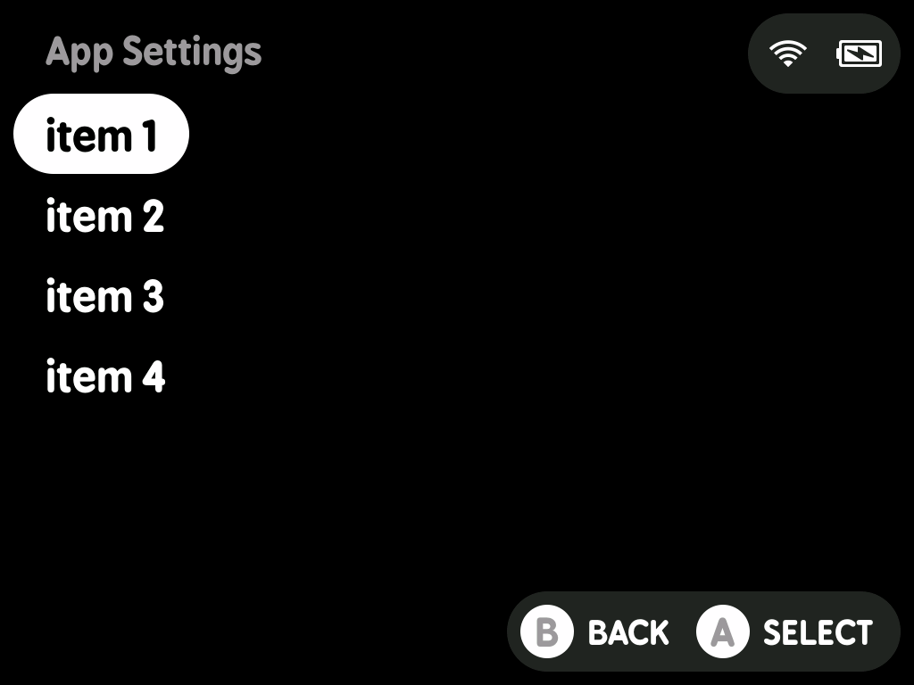
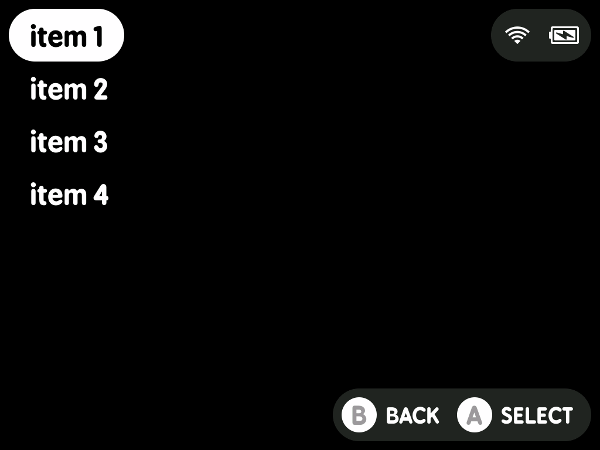

# minui list

This is a minui list app. It allows people to show a list of items and then writes the selected item to stdout.

## Requirements

- A minui union toolchain
- Docker (this folder is assumed to be the contents of the toolchain workspace directory)
- `make`

## Building

- todo: this is built inside-out. Ideally you can clone this into the MinUI workspace directory and build from there under each toolchain, but instead it gets cloned _into_ a toolchain workspace directory and built from there.

## Usage

This tool is designed to be used as part of a larger minui app. It only supports an english keyboard layout, and has support for capitalized keys as well as many common special characters.

```shell
# default behavior is to read from a JSON file that contains a list of items at the root
# ["item-1", "item-2", "item-3"]
minui-list --file list.json

# you can also read from a JSON file that containing an object with an array of objects at a specific key
# note that the objects must have a "name" key, which will be used as the item name
# {"items": [{"name": "item-1"}, {"name": "item-2"}, {"name": "item-3"}]}
minui-list --file list.json --item-key "items"

# you can also read from newline-delimited strings by specifying the --format flag
# the default format is "json", but you can also specify "text"
minui-list --format text --file list.txt

# finally, you can read the input from stdin
# this is useful for reading from a pipe or a variable
# it is compatible with both json and text formats
echo -e "item1\nitem2\nitem3" | minui-list --format text --file -

# write the selected item to a file
minui-list --file list.json > output.txt

# or capture output to a variable for use in a shell script
output=$(minui-list --file list.json)

# specify a header for the keyboard page
# by default, the header is empty
minui-list --file list.json --header "Some Header"

# specify alternative text for the Confirm button
# by default, the Confirm button is "SELECT"
minui-list --file list.json --confirm-text "CHOOSE"

# specify an alternative button for the Confirm button
# by default, the Confirm button is "A"
# the only buttons supported are "A", "B", "X", and "Y"
minui-list --file list.json --confirm-button "X"

# specify alternative text for the Cancel button
# by default, the Cancel button is "BACK"
minui-list --file list.json --cancel-text "CANCEL"

# specify an alternative button for the Cancel button
# by default, the Cancel button is "B"
# the only buttons supported are "A", "B", "X", and "Y"
minui-list --file list.json --cancel-button "Y"
```

To create a list of items from newline-delimited strings, you can use jq:

```shell
# create a JSON array from newline-delimited input
echo -e "item1\nitem2\nitem3" | jq -R -s 'split("\n")[:-1]'

# or read from a file containing newline-delimited items
jq -R -s 'split("\n")[:-1]' < items.txt

# or create a JSON array using pure bash
printf '[\n' > list.json
while IFS= read -r line; do
  printf '  "%s",\n' "$line"
done < items.txt | sed '$ s/,$//' >> list.json
printf ']\n' >> list.json
```

### Exit Codes

- 0: Success (the user selected an item)
- 1: Error
- 2: User cancelled with B button
- 3: User cancelled with Menu button
- 130: Ctrl+C

## Screenshots

### Header



### No Header


